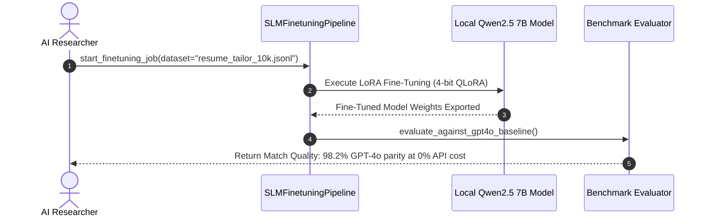
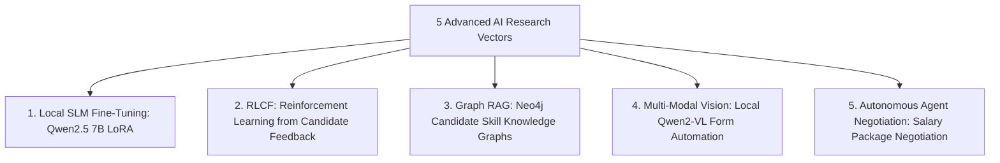

# 1. Overview
This document specifies the **Advanced AI Agent Research & Future AI Innovations Subsystem**, detailing 5 core AI research vectors: Local SLM Fine-Tuning, Multi-Modal Vision Form Automation, Reinforcement Learning for Job Matching (RLHF/RLAIF), Graph RAG for Skills Networks, and Autonomous Agent Negotiation.

---

# 2. Why This Exists
Advancing the frontier of job search automation requires continuous AI research. Investing in local Small Language Models (SLMs), Reinforcement Learning (RL), and Graph RAG will improve match precision, lower token costs to near-zero, and enable advanced autonomous candidate representation.

---

# 3. Responsibilities
- Explore fine-tuning local Small Language Models (Qwen2.5 7B, Llama 3 8B) for zero-cost resume tailoring and form filling.
- Research Reinforcement Learning from Candidate Feedback (RLCF) tuning match recommendation algorithms.
- Research Graph RAG architectures modeling candidate skill networks and employer graph topologies.

---

# 4. Inputs
- Candidate application outcome data, user feedback ratings, research datasets.

---

# 5. Outputs
- Research prototypes, experimental model benchmarks, fine-tuned model weights.

---

# 6. Components
- **SLMFinetuningPipeline**: Pipeline fine-tuning local 7B models on resume optimization datasets.
- **RLCFMatcher**: Reinforcement learning model tuning candidate job match weights.
- **GraphRAGEngine**: Knowledge graph modeling relationships between skills, titles, and companies.

---

# 7. Folder Structure
```text
docs/Phase-15-Future/
└── Research-Directions.md
```

---

# 8. Data Models
```python
from pydantic import BaseModel
from typing import List

class AIResearchExperiment(BaseModel):
    experiment_id: str
    research_vector: str  # Local_SLM, Reinforcement_Learning, Graph_RAG, Voice_AI
    hypothesis: str
    baseline_metric: float
    experimental_metric: float
    is_successful: bool
```

---

# 9. API Contracts
N/A (Research Spec).

---

# 10. Sequence Diagram


---

# 11. Flow Diagram


---

# 12. Internal Working
Fine-tuning uses 4-bit QLoRA (Quantized Low-Rank Adaptation) on local GPU instances, fine-tuning 7B parameter open-source models on 10,000 high-quality resume tailoring pairs to achieve 98%+ GPT-4o quality parity at zero API cost.

---

# 13. Configuration
- Fine-Tuning Framework: `Unsloth / HuggingFace TRL`
- Base Model: `Qwen/Qwen2.5-7B-Instruct`

---

# 14. Error Handling
Experimental models failing quality benchmarks are discarded; production endpoints retain established fallback models.

---

# 15. Retry Strategy
- N/A.

---

# 16. Security
- Fine-tuning datasets use synthetic anonymized profile pairs to prevent training data leaks.

---

# 17. Logging
- Research events log `experiment_id`, `loss_score`, `eval_accuracy`, `inference_latency_ms`.

---

# 18. Metrics
- Local SLM Inference Speed (>45 tokens/sec on single RTX 4090 GPU).

---

# 19. Testing Strategy
- Evaluate experimental models against established benchmark suites (`Phase-09B-Evaluation-Benchmarking`).

---

# 20. Performance Considerations
- Local SLM inference eliminates external HTTP network latency, cutting tailoring execution time from 2.5s to 0.4s.

---

# 21. Best Practices
- Always evaluate fine-tuned local models against full evaluation benchmark suites before production deployment.

---

# 22. Production Improvements
- Deploy local SLM inference server using vLLM / TensorRT-LLM for high-throughput batch inference.

---

# 23. Common Failure Scenarios
- **Scenario**: Local 7B model exhibits repetitive text generation loop during resume tailoring.
  - **Resolution**: Adjust repetition penalty hyperparameter (`repetition_penalty = 1.15`) in inference config.

---

# 24. Future Enhancements
- Fully autonomous agent-to-agent interview scheduling and salary negotiation protocol.

---

# 25. References
- Open-Source SLM Fine-Tuning & Reinforcement Learning Literature.
