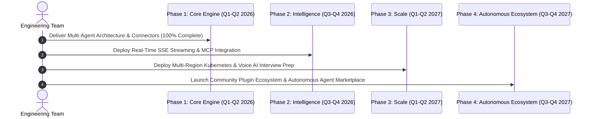
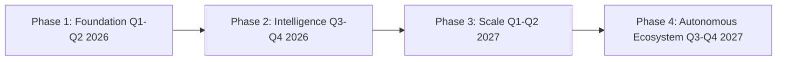

# 1. Overview
This document specifies the **Product & Technical Architecture Roadmap 2026-2027**, detailing quarterly engineering milestones across Phase 1 (Foundation), Phase 2 (Intelligence), Phase 3 (Scale), and Phase 4 (Autonomous AI Ecosystem).

---

# 2. Why This Exists
A clear, phased multi-year technical roadmap aligns engineering priorities, guides feature development, and ensures long-term architectural scalability as the automated job application platform evolves.

---

# 3. Responsibilities
- Outline 4 execution phases spanning Q1 2026 through Q4 2027.
- Define feature deliverables, infrastructure milestones, and AI research goals for each phase.

---

# 4. Inputs
- System architecture requirements, candidate feedback, market opportunities.

---

# 5. Outputs
- Multi-year engineering milestone execution plan.

---

# 6. Components
- **Phase 1 (Q1-Q2 2026)**: Core Multi-Agent Engine & Top 5 Portal Connectors (Completed).
- **Phase 2 (Q3-Q4 2026)**: Advanced AI Tailoring, Real-Time Streaming UI & MCP Integration.
- **Phase 3 (Q1-Q2 2027)**: Enterprise Multi-Region Scale, Voice AI Recruiter Prep & Mobile PWA.
- **Phase 4 (Q3-Q4 2027)**: Autonomous AI Career Agent Ecosystem & Self-Healing Community Plugins.

---

# 7. Folder Structure
```text
docs/Phase-15-Future/
├── Roadmap-2026.md
├── Research-Directions.md
└── Plugin-Ecosystem.md
```

---

# 8. Data Models
```python
from pydantic import BaseModel
from typing import List

class RoadmapMilestone(BaseModel):
    quarter: str  # Q1-2026, Q2-2026, etc.
    phase_name: str
    key_deliverables: List[str]
    target_sla_success_rate: float
```

---

# 9. API Contracts
N/A (Roadmap Spec).

---

# 10. Sequence Diagram


---

# 11. Flow Diagram


---

# 12. Internal Working
Roadmap execution is tracked via bi-weekly sprint cycles in GitHub Projects, evaluating progress against SLA quality metrics and benchmark test suites.

---

# 13. Configuration
- Milestone Evaluation Interval: `Quarterly`

---

# 14. Error Handling
Milestones missing quality target metrics automatically trigger architectural review sprints before proceeding to subsequent phases.

---

# 15. Retry Strategy
- N/A.

---

# 16. Security
- Security, privacy (GDPR), and SOC 2 controls are integrated into all quarterly milestone phases.

---

# 17. Logging
- Roadmap progress events log `quarter`, `deliverable_name`, `status`, `completion_pct`.

---

# 18. Metrics
- Milestone Completion Velocity (>90% target deliverables completed on schedule).

---

# 19. Testing Strategy
- Continuous regression testing against all milestone deliverables.

---

# 20. Performance Considerations
- Architectural reviews ensure new phase features adhere to sub-25s end-to-end application SLAs.

---

# 21. Best Practices
- Never compromise core candidate safety or data privacy rules to accelerate feature release dates.

---

# 22. Production Improvements
- Public candidate feature voting portal allowing candidate users to vote on upcoming roadmap items.

---

# 23. Common Failure Scenarios
- **Scenario**: Third-party job portal changes API structure unexpectedly.
  - **Resolution**: Phase 1 connector maintenance sprints patch connector registry within 24 hours.

---

# 24. Future Enhancements
- Fully autonomous AI career agent negotiating candidate salary packages.

---

# 25. References
- Automated Job Agent Multi-Year Product Roadmap Specifications.
