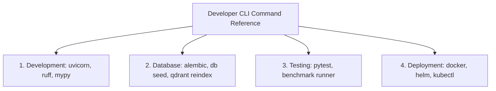

# 1. Overview
this document specifies the **Developer CLI Utility & Operational Command Reference**, detailing command-line utilities (`jobagent`), database management commands, test execution scripts, container commands, and deployment scripts.

---

# 2. Why This Exists
Developers, SREs, and system administrators require a quick reference for common terminal commands: starting local dev servers, running test suites, executing database migrations, building containers, and troubleshooting Kubernetes clusters.

---

# 3. Responsibilities
- Provide command-line reference for development, database, testing, Docker, Kubernetes, and maintenance tasks.
- Document options, flags, and expected outputs for all commands.

---

# 4. Inputs
- Terminal CLI execution commands.

---

# 5. Outputs
- Operational command execution reference guide.

---

# 6. Components
- **Development Commands**: Local server launch, hot reloading, linting.
- **Database Commands**: Alembic migrations, database seeding, vector indexing.
- **Testing Commands**: Pytest unit tests, benchmark evaluation suites.
- **Container & Deployment**: Docker build, Helm upgrade, kubectl diagnostics.

---

# 7. Folder Structure
```text
docs/Phase-16-Appendix/
└── CLI-Commands.md
```

---

# 8. Data Models
```python
from pydantic import BaseModel

class CLICommandEntry(BaseModel):
    category: str  # Dev, DB, Test, Docker, K8s
    command: str
    description: str
    example_usage: str
```

---

# 9. API Contracts
N/A (CLI Reference Spec).

---

# 10. Sequence Diagram
N/A.

---

# 11. Flow Diagram


---

# 12. Internal Working
Exhaustive Command Reference Table:

### 12.1 Local Development Commands
```bash
# Start FastAPI backend server with hot-reload
uvicorn backend.app.main:app --reload --host 0.0.0.0 --port 8000

# Start frontend Vite development server
cd frontend && npm run dev

# Run Ruff linter and code formatter
ruff check backend/
ruff format backend/

# Run MyPy static type checker
mypy backend/app/
```

### 12.2 Database Management Commands
```bash
# Apply pending database schema migrations
alembic upgrade head

# Generate a new database migration script
alembic revision --autogenerate -m "Add new column"

# Seed test database with synthetic candidate profiles
python -m scripts.seed_database --count 10

# Rebuild Qdrant vector store indexes
python -m scripts.reindex_vector_store --collection jobs
```

### 12.3 Testing & Evaluation Commands
```bash
# Run all unit tests with coverage report
pytest --cov=backend --cov-report=term-missing

# Run matching engine accuracy benchmark suite
python -m tests.benchmarks.run_matching_benchmarks

# Run resume tailoring evaluation suite
python -m tests.benchmarks.run_resume_benchmarks

# Run end-to-end campaign evaluation suite
python -m tests.benchmarks.run_e2e_suite
```

### 12.4 Docker & Kubernetes Commands
```bash
# Build multi-stage backend container image
docker build -t job-agent-backend:latest -f Dockerfile.backend .

# Launch local multi-container stack via Docker Compose
docker-compose up -d

# Inspect Kubernetes deployment status
kubectl get pods -n job-agent-prod -o wide

# View live backend application logs
kubectl logs -n job-agent-prod -l app=backend-api --tail=100 -f

# Upgrade Helm deployment release
helm upgrade --install job-agent deploy/helm/job-agent -f values-prod.yaml
```

---

# 13. Configuration
- N/A.

---

# 14. Error Handling
- N/A.

---

# 15. Retry Strategy
- N/A.

---

# 16. Security
- Production commands require explicit IAM authentication credentials.

---

# 17. Logging
- N/A.

---

# 18. Metrics
- N/A.

---

# 19. Testing Strategy
- Verify that documented CLI commands execute cleanly in local development environments.

---

# 20. Performance Considerations
- N/A.

---

# 21. Best Practices
- Always verify active Kubernetes context (`kubectl config current-context`) before executing mutating cluster commands.

---

# 22. Production Improvements
- Custom CLI wrapper script (`jobagent-cli`) unifying all management commands into a single terminal utility.

---

# 23. Common Failure Scenarios
- N/A.

---

# 24. Future Enhancements
- Interactive terminal TUI dashboard for candidate application management.

---

# 25. References
- Uvicorn, Alembic, Docker, Helm, and Kubectl Command References.
