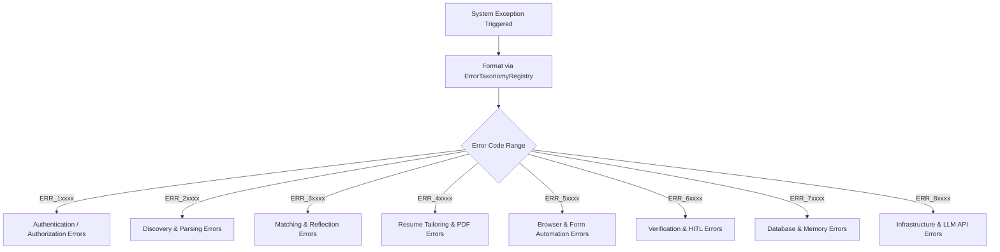

# 1. Overview
This document specifies the **System Error Code Taxonomy & Diagnostic Reference**, detailing standardized 5-digit error code ranges (`ERR_1xxxx` through `ERR_8xxxx`), error descriptions, root causes, and developer remediation steps.

---

# 2. Why This Exists
Standardizing system error codes across micro-agents, API routes, database services, and browser automation modules enables rapid incident identification, structured logging analysis, and automated error recovery handling.

---

# 3. Responsibilities
- Define 5-digit error code ranges across system domains.
- Provide error messages, descriptions, root cause diagnostics, and resolution steps for every error code.

---

# 4. Inputs
- System error events, exception traces, status codes.

---

# 5. Outputs
- Standardized error code payload returned in API error responses.

---

# 6. Components
- **ErrorTaxonomyRegistry**: Central registry of all system error codes.
- **APIErrorFormatter**: Formats exceptions into standardized error payloads.

---

# 7. Folder Structure
```text
docs/Phase-16-Appendix/
└── Error-Codes-Reference.md
```

---

# 8. Data Models
```python
from pydantic import BaseModel

class SystemErrorCodeDefinition(BaseModel):
    code: str  # ERR_10001, ERR_30002, etc.
    domain: str  # Auth, Matching, Automation, Database, LLM
    message: str
    description: str
    remediation_steps: str
```

---

# 9. API Contracts
Standardized Error Payload Contract:
```json
{
  "status_code": 400,
  "error_code": "ERR_30002",
  "message": "Candidate Disqualified: Visa Sponsorship Not Offered",
  "description": "Job description explicitly specifies no visa sponsorship offered, violating candidate visa requirement setting.",
  "remediation": "Candidate can adjust visa requirement settings in profile or skip role."
}
```

---

# 10. Sequence Diagram
N/A.

---

# 11. Flow Diagram


---

# 12. Internal Working
System Error Code Taxonomy Table:
| Error Code | Domain | Description | Remediation Steps |
|---|---|---|---|
| `ERR_10001` | Auth | JWT Token Expired | Re-authenticate via `/api/v1/auth/login` |
| `ERR_10002` | Auth | Invalid Bearer Token | Verify Authorization header token format |
| `ERR_20001` | Discovery | Scraper Rate Limit Block | Rotate proxy IP and wait 60 seconds |
| `ERR_20002` | Discovery | Job Description Unparseable | Verify target job URL format |
| `ERR_30001` | Matching | Blacklisted Company Block | Candidate applied rule blocking current employer |
| `ERR_30002` | Matching | Visa Sponsorship Disqualification | Job specifies no visa sponsorship |
| `ERR_40001` | Tailoring | LaTeX PDF Compilation Failed | Sanitize special characters and retry compilation |
| `ERR_40002` | Tailoring | Hallucination Guardrail Triggered | LLM generated skill not in master profile |
| `ERR_50001` | Automation | Playwright Element Timeout | Check DOM locator or execute self-healing fallback |
| `ERR_50002` | Automation | CAPTCHA Challenge Block | Escalate to 2Captcha API or HITL prompt |
| `ERR_60001` | Verification| Confirmation DOM Not Found | Run Vision OCR verification fallback |
| `ERR_60002` | Verification| HITL Approval Expired | Candidate approval window timed out (>24h) |
| `ERR_70001` | Database | Duplicate Application Integrity Error | Application already exists in database |
| `ERR_70002` | Database | Connection Pool Exhaustion | Scale PgBouncer pool or increase DB max_connections |
| `ERR_80001` | System | LLM Provider API HTTP 429 | Exponential backoff retry or model switch |
| `ERR_80002` | System | Redis Broker Unreachable | Restart Redis service or failover to Sentinel replica |

---

# 13. Configuration
- N/A.

---

# 14. Error Handling
Unmapped exceptions default to `ERR_80000` (Internal System Error).

---

# 15. Retry Strategy
- N/A.

---

# 16. Security
- Error details omit sensitive passwords, tokens, or system file paths.

---

# 17. Logging
- Error events log `error_code`, `domain`, `message`, `stack_trace_hash`.

---

# 18. Metrics
- Error Distribution Metrics tracked in Prometheus.

---

# 19. Testing Strategy
- Unit test error taxonomy registry mappings.

---

# 20. Performance Considerations
- Error code lookup is an $O(1)$ dictionary operation.

---

# 21. Best Practices
- Always return explicit 5-digit error codes in all client-facing API error responses.

---

# 22. Production Improvements
- Interactive online error code lookup documentation tool for developers.

---

# 23. Common Failure Scenarios
- N/A.

---

# 24. Future Enhancements
- Machine-learning suggested resolution actions based on historical error code resolution data.

---

# 25. References
- Enterprise Error Code Taxonomy Specifications.
