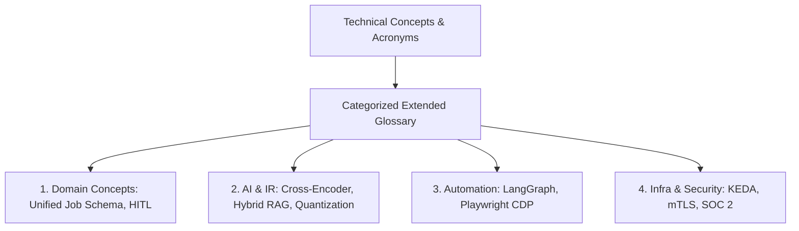

# 1. Overview
This document specifies the **Extended Technical Terminology & Architectural Glossary**, detailing comprehensive technical terms, acronym definitions, domain concepts, and architectural patterns referenced across all handbook phases.

---

# 2. Why This Exists
A complex multi-agent platform incorporates concepts from Information Retrieval (IR), Large Language Models (LLMs), Browser Automation, Kubernetes Infrastructure, and Distributed Systems. Maintaining an exhaustive, cross-referenced glossary ensures clear developer onboarding.

---

# 3. Responsibilities
- Provide comprehensive technical definitions for all system concepts and terminology.
- Cross-reference domain terms to relevant handbook specification documents.

---

# 4. Inputs
- Architectural concepts, domain terms, acronyms across all 26 handbook phases.

---

# 5. Outputs
- Categorized, cross-referenced technical glossary artifact.

---

# 6. Components
- **Domain Concepts**: Unified Job Schema, Match Score Matrix, Reflection Check, HITL Gate.
- **AI & Retrieval**: Cross-Encoder, Dense Embedding, BM25, Hybrid Search, RAG, Quantization, RLCF.
- **Automation & Orchestration**: LangGraph, StateGraph, Playwright CDP, Connector Registry, Stealth Patches.
- **Infrastructure & Security**: OTLP, PromQL, KEDA, HPA, mTLS, Workload Identity, SOC 2, GDPR.

---

# 7. Folder Structure
```text
docs/Phase-16-Appendix/
├── Glossary-Extended.md
├── Error-Codes-Reference.md
└── CLI-Commands.md
```

---

# 8. Data Models
```python
from pydantic import BaseModel

class ExtendedGlossaryEntry(BaseModel):
    term: str
    category: str
    definition: str
    related_document: str
```

---

# 9. API Contracts
N/A (Appendix Spec).

---

# 10. Sequence Diagram
N/A.

---

# 11. Flow Diagram


---

# 12. Internal Working
Exhaustive Technical Glossary Terms:
- **Agentic RAG**: Retrieval-Augmented Generation where intelligent micro-agents dynamically determine query parameters, metadata filters, and retrieval sources before passing context to LLMs.
- **Applicant Tracking System (ATS)**: Corporate software used by employers to collect, parse, rank, and track candidate job applications (e.g. Greenhouse, Workday, Lever, Taleo).
- **BM25**: Best Matching 25 sparse keyword retrieval algorithm scoring document-query relevance based on term frequency and inverse document frequency.
- **Cross-Encoder**: Deep learning model evaluating joint attention across candidate text and job description pairs, generating accurate semantic similarity scores.
- **Human-in-the-Loop (HITL)**: Workflow architecture pattern pausing autonomous execution to obtain manual human candidate approval for flagged inputs.
- **LangGraph**: State graph orchestration framework for building complex multi-agent workflows with durable state checkpointing.
- **Model Context Protocol (MCP)**: Open protocol enabling AI models to interact with external tools, resources, and prompt templates.
- **Normalized Discounted Cumulative Gain (NDCG@K)**: Information retrieval metric evaluating ranking quality based on graded relevance of top-K results.
- **Playwright CDP**: Chrome DevTools Protocol interface allowing programmatic control over Chromium browser contexts.
- **Scalar Quantization (SQ8)**: Vector compression technique converting float32 vector numbers to int8 integers, reducing RAM footprint by 75%.

---

# 13. Configuration
- N/A.

---

# 14. Error Handling
- N/A.

---

# 15. Retry Strategy
- N/A.

---

# 16. Security
- N/A.

---

# 17. Logging
- N/A.

---

# 18. Metrics
- N/A.

---

# 19. Testing Strategy
- Verify glossary cross-references against active documentation filenames.

---

# 20. Performance Considerations
- N/A.

---

# 21. Best Practices
- Keep technical definitions precise, concise, and updated alongside system evolutions.

---

# 22. Production Improvements
- Interactive search filter in frontend documentation suite.

---

# 23. Common Failure Scenarios
- N/A.

---

# 24. Future Enhancements
- Visual concept diagrams linked directly inside glossary definitions.

---

# 25. References
- Information Retrieval & AI Agent Technical Literature.
