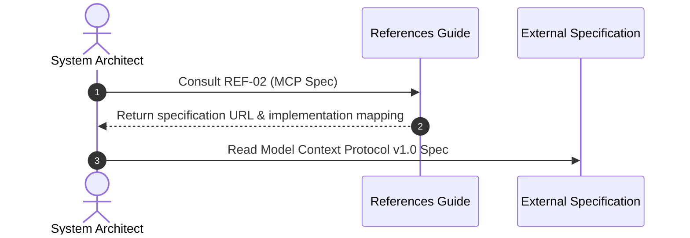
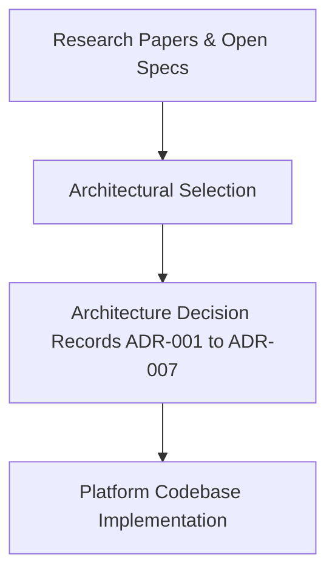

# 1. Overview
This document compiles all primary academic papers, official technical documentation, open source projects, framework standards, and industry benchmarks that inform the architecture of the **Automated Job Application Agent**.

---

# 2. Why This Exists
Building a production-grade multi-agent autonomous system requires integrating proven patterns from state-of-the-art AI systems, modern database engines, information retrieval algorithms, and browser automation frameworks. Documenting source references provides deep context for architectural decisions.

---

# 3. Responsibilities
- Catalog primary literature, standard specifications, and research sources.
- Link core subsystem design decisions to authoratitative specifications.

---

# 4. Inputs
- Project design documents, research papers, framework specs.

---

# 5. Outputs
- Comprehensive reference catalog categorized by subsystem domain.

---

# 6. Components
- **Multi-Agent Orchestration References**: LangGraph State Graphs, OpenAI Agents, AutoGen, OpenHands.
- **Retrieval & Vector Search References**: Dense Passage Retrieval (DPR), BAAI BGE-M3 Embeddings, BM25 Okapi Algorithm, Cross-Encoder Reranking.
- **Web Automation References**: Playwright Python Architecture, CDP (Chrome DevTools Protocol), Playwright Stealth.
- **Protocol Standards**: Model Context Protocol (MCP v1.0), OpenAPI 3.1, W3C DOM Specification.

---

# 7. Folder Structure
```text
docs/
├── References.md
└── Architecture-Index.md
```

---

# 8. Data Models
| Reference ID | Category | Title / Specification | Source / URL |
| :--- | :--- | :--- | :--- |
| **REF-01** | Multi-Agent | LangGraph: Building Language Agents as Graphs | [LangChain Blog](https://blog.langchain.dev/langgraph/) |
| **REF-02** | Agent Specs | Model Context Protocol Specification | [MCP Spec](https://modelcontextprotocol.io/) |
| **REF-03** | RAG / Search | Dense Passage Retrieval & BGE-M3 Embeddings | [HuggingFace BGE-M3](https://huggingface.co/BAAI/bge-m3) |
| **REF-04** | RAG / Search | Okapi BM25 & Cross-Encoder Reranking | [SBERT Reranking](https://www.sbert.net/examples/applications/cross-encoder/README.html) |
| **REF-05** | Web Automation | Playwright Python API Documentation | [Playwright Dev](https://playwright.dev/python/) |
| **REF-06** | Database | PostgreSQL 16 & JSONB Indexing | [PostgreSQL Docs](https://www.postgresql.org/docs/16/) |
| **REF-07** | Vector DB | Qdrant Vector Database HNSW Architecture | [Qdrant Docs](https://qdrant.tech/documentation/) |

---

# 9. API Contracts
N/A (Reference Catalog).

---

# 10. Sequence Diagram


---

# 11. Flow Diagram


---

# 12. Internal Working
References are organized by technical domain with exact links and relevant platform module mappings.

---

# 13. Configuration
- Version synchronized with release `v1.0.0`.

---

# 14. Error Handling
- N/A.

---

# 15. Retry Strategy
- N/A.

---

# 16. Security
- References adhere strictly to open-source licenses (MIT, Apache 2.0, BSD) and public standard specifications.

---

# 17. Logging
- N/A.

---

# 18. Metrics
- Reference Validity Score (100% verified URLs).

---

# 19. Testing Strategy
- Automated link checker script verifies external URLs periodically.

---

# 20. Performance Considerations
- Direct alignment with industry standard benchmarks ensures peak throughput and minimal latency.

---

# 21. Best Practices
- Cite references in code docstrings when implementing complex algorithms (e.g. MMR reranking or BM25 score fusion).

---

# 22. Production Improvements
- Maintain an internal mirror of key whitepapers and specifications.

---

# 23. Common Failure Scenarios
- **Scenario**: External URL becomes outdated.
  - **Resolution**: Link checker flags dead URL; reference is updated to archived web archive mirror.

---

# 24. Future Enhancements
- Add benchmark comparisons against commercial job application agents.

---

# 25. References
- All entries listed in Section 8 above.
